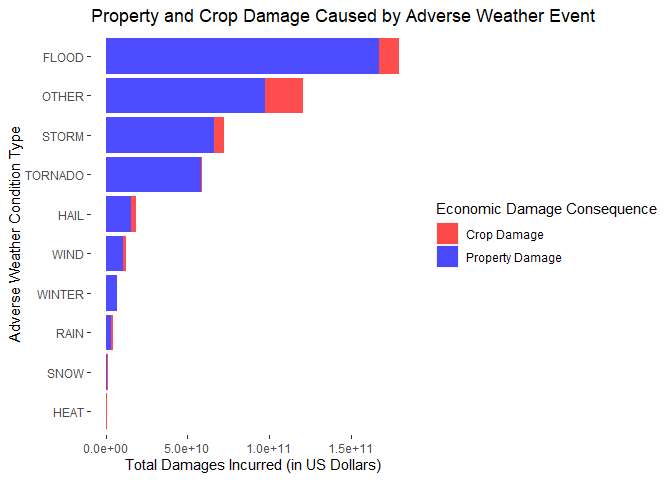
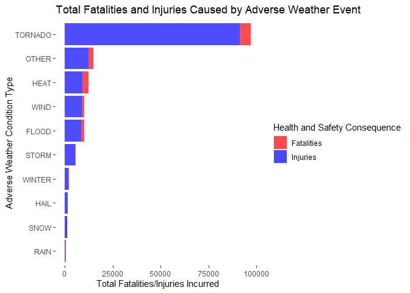

<style type="text/css">

body, td {
   font-size: 19px;
}
</style>


<center> <h1>Health and Economic Impact of Storm <br> A Report Based on NOAA Storm Database</h1> </center>


<br>
<br>

## Synopsis


Storms and other severe weather events have caused both public health and economic problems across the US. Over the years, we have seen severe adverse weather cases causing fatalities, injuries, and property damage. prevention and Reduction of negative socio-economic impact caused by major severe adverse weather events have become a key policy concern shared by US governments of all levels.

This project aims at providing data-driven intelligence on the health and impact of 
adverse weather events for US policy makers. Our analysis is based on the U.S. National Oceanic and Atmospheric Administration’s (NOAA) storm database. The report first shows the process of data processing. Then, analysis and results are presented, followed by a brief discussion of the result's policy implication. 

<br>

## Data Processing


```r
library(tidyverse) # multi-purpose
library(data.table) # for reading into data
library(R.utils) # for reading into data
```
<br>

### Data

The data used in this analysis is fully accessible online through [NOAA Storm Data](https://d396qusza40orc.cloudfront.net/repdata%2Fdata%2FStormData.csv.bz2).Documentation related to the relevant database can be accesed at:

-[National Weather Service](https://d396qusza40orc.cloudfront.net/repdata%2Fpeer2_doc%2Fpd01016005curr.pdf)

-[National Climatic Data Center Storm Events FAQ](https://d396qusza40orc.cloudfront.net/repdata%2Fpeer2_doc%2FNCDC%20Storm%20Events-FAQ%20Page.pdf)


```r
fileurl = "https://d396qusza40orc.cloudfront.net/repdata%2Fdata%2FStormData.csv.bz2"

if (!file.exists("./data")){dir.create("./data")}

if (!file.exists("./data/storm.bz2")){
download.file(fileurl, file.path("./data/storm.bz2"))
}

dt <- fread("./data/storm.bz2")
```
<br>

### Data Preperation

Our analysis uses the following variables in the NOAA dataset:

Variables concerning health effect:

- `FATALITIES`: Approximate number of deaths
- `INJURIES`: Approximate number of injuries

Variables concerning economic effect:

- `PROPDMG`: approximate property damages
- `PROPDMGEXP`: Units for property damage value
- `CROPDMG`: approximate crop damages
- `CROPDMGEXP`: Units for crop damage value

Variables concerning Adverse weather event Type:

- `EVTYPE`: Adverse weather event type (Tornado, Wind, Snow, Flood, etc..)

<br>


```r
vars <- c("EVTYPE", "FATALITIES", "INJURIES", "PROPDMG", "PROPDMGEXP", "CROPDMG", "CROPDMGEXP")
df <- as.data.frame(dt[, ..vars])
```


```r
sum(is.na(df))
```

```
## [1] 0
```

<br>

Three new variables were created based on the original variables in the dataset. 
The three variables are: `event`, `dproperty`, and `dcrop`. The process of creating each of the three variables are as followed: 

`event` is created based on `EVTYPE`. `event` organized all types of adverse wether type into 10 types: hail, heat, flood, wind, storm, snow, tornado, winter, and rain.


```r
# create a new variable EVENT to organize EVTYPE into 10 levels
df$event <- "OTHER"
# group by keyword in EVTYPE
df$event[grep("HAIL", df$EVTYPE, ignore.case = TRUE)] <- "HAIL"
df$event[grep("HEAT", df$EVTYPE, ignore.case = TRUE)] <- "HEAT"
df$event[grep("FLOOD",df$EVTYPE, ignore.case = TRUE)] <- "FLOOD"
df$event[grep("WIND", df$EVTYPE, ignore.case = TRUE)] <- "WIND"
df$event[grep("STORM",df$EVTYPE, ignore.case = TRUE)] <- "STORM"
df$event[grep("SNOW", df$EVTYPE, ignore.case = TRUE)] <- "SNOW"
df$event[grep("TORNADO",df$EVTYPE, ignore.case = TRUE)] <- "TORNADO"
df$event[grep("WINTER", df$EVTYPE, ignore.case = TRUE)] <- "WINTER"
df$event[grep("RAIN", df$EVTYPE, ignore.case = TRUE)] <- "RAIN"
# Show the new variable
sort(table(df$event), decreasing = TRUE)
```

```
## 
##    HAIL    WIND   STORM   FLOOD TORNADO   OTHER  WINTER    SNOW    RAIN    HEAT 
##  289270  255362  113156   82686   60700   48970   19604   17660   12241    2648
```
<br>

Variable `dproperty` describes values for property damage (in dollars). Similarly, `dcrop` describes values for crop damage (in dollars). They are created based on `PROPDMG`, `PROPDMGEXP`, `CROPDMG`, and `CROPDMGEXP`. `dproperty` is the product of the dollar value recorded in `PROPDMG` and the dollar unit recorded in `CROPDMGEXP`.  `dcrop` is the product of the dollar value recorded in `CROPDMG` and the dollar unit recorded in `CROPDMGEXP`.


The dollar unit recorded in `CROPDMGEXP` and `CROPDMGEXP` is recoded in the following way:


- K or k: thousand dollars (10^3)
- M or m: million dollars (10^6)
- B or b: billion dollars (10^9)
- All Others: processed as dollars


```r
df$PROPDMGEXP <- as.character(df$PROPDMGEXP)

df$propdmgexp <- 0
df$propdmgexp[grep("K", df$PROPDMGEXP,ignore.case = TRUE)] <- 3
df$propdmgexp[grep("M", df$PROPDMGEXP,ignore.case = TRUE)] <- 6
df$propdmgexp[grep("B", df$PROPDMGEXP,ignore.case = TRUE)] <- 9

df$dproperty <- df$PROPDMG * (10^df$propdmgexp)
```


```r
df$CROPDMGEXP <- as.character(df$CROPDMGEXP)

df$cropdmgexp <- 0
df$cropdmgexp[grep("K", df$CROPDMGEXP,ignore.case = TRUE)] <- 3
df$cropdmgexp[grep("M", df$CROPDMGEXP,ignore.case = TRUE)] <- 6
df$cropdmgexp[grep("B", df$CROPDMGEXP,ignore.case = TRUE)] <- 9

df$dcrop <- df$CROPDMG * (10^df$cropdmgexp)
```
<br>
First 10 most-appeared values for property damage (in dollars) 

```r
sort(table(df$dproperty),decreasing=TRUE)[1:10]
```

```
## 
##      0   5000  10000   1000   2000  25000  50000   3000  20000  15000 
## 663123  31731  21787  17544  17186  17104  13596  10364   9179   8617
```
<br>
First 10 most-appeared values for crop damage (in dollars) 

```r
sort(table(df$dcrop),decreasing=TRUE)[1:10]
```

```
## 
##      0   5000  10000  50000  1e+05   1000   2000  25000  20000  5e+05 
## 880198   4097   2349   1984   1233    956    951    830    758    721
```

<br>

## Data Analysis


The table below shows that among all ten types of adverse weather condition in the US, flood is the one that causes the most severe economic loss in general. Flood also incurs the heaviest property damage and crop damage, surpassing the second ranked type- storm, by a significant amount in both property damage and crop damage. 


```r
# Split df by event and apply summarize function on dproperty and dcrop
aggpcd <- df %>% group_by(event) %>% 
        summarise(Total_Damage=sum(dproperty + dcrop, na.rm=TRUE)) %>% 
        arrange(desc(Total_Damage))
aggpcd$Type <- "property+crop_damage"

# Split df by event and apply summarize function on dproperty
aggp <- df %>% group_by(event) %>% 
        summarise(Total_Damage=sum(dproperty, na.rm = TRUE)) %>% 
        arrange(desc(Total_Damage))
aggp$Type <- "property_damage"

# Split df by event and apply summarize function on dcrop
aggc <- df %>% group_by(event) %>% 
        summarise(Total_Damage=sum(dcrop, na.rm = TRUE)) %>% 
        arrange(desc(Total_Damage))
aggc$Type <- "crop_damage"
```


```r
# Combine, sorted by total damage of property and crop
ecoimpact <- aggpcd %>% 
        left_join(aggp, by='event') %>% left_join(aggc, by='event')
```
<br>

On the other hand, tornado is the number one threat for public heath and safety, causing a total of 5,661 death and 91,407 injuries over the years. Heat is a distant second, causing 2,626 deaths and 12,224 injuries over the years. 


```r
# Split the dataset by event and apply summarize on fataltiies and injuries 
aggft <- df %>% group_by(event) %>% 
        summarise(Total = sum(FATALITIES, INJURIES,na.rm = TRUE)) %>%
        arrange(desc(Total))
aggft$Type <- "fatalities+injuries"

# Split the dataset by event and apply summarize on fatalities
aggf <- df %>% group_by(event) %>% 
        summarise(Total = sum(FATALITIES, na.rm = TRUE)) %>% 
        arrange(desc(Total))
aggf$Type <- "fatalities"

# Split the dataset by event and apply summarize on injuries
aggi <- df %>% group_by(event) %>% 
        summarise(Total = sum(INJURIES, na.rm = TRUE)) %>% 
        arrange(desc(Total))
aggi$Type <- "injuries"
```


```r
healthimpact <- aggft %>% left_join(aggf, by='event') %>% 
        left_join(aggi, by='event')
```

<br>

## Results


The data visualization result confirms the result in our previous section. Flood is the single most threatening adverse weather condition for property and crop. Overshadowing all other types of adverse weather condition. The economic loss caused by flood alone surpasses the loss caused by storm and tornado combined, which are the second and third threatening adverse weather condition in the US. 


```r
eco <- rbind(aggp, aggc)
```


```r
eco$event <- as.factor(eco$event)

ggplot(data=eco, aes(reorder(event, Total_Damage),Total_Damage, fill=Type)) +
        geom_bar(stat='identity') + coord_flip() +
        labs(x="Adverse Weather Condition Type",
            y="Total Damages Incurred (in US Dollars)",
            title="Property and Crop Damage Caused by Adverse Weather Event")+
        scale_fill_manual(values = alpha(c("red", "blue"), .7),
                          name = "Economic Damage Consequence",
                          labels=c('Crop Damage','Property Damage'))+
        theme(panel.grid.major = element_blank(), 
              panel.grid.minor = element_blank(),
              panel.background = element_blank())
```

<!-- -->


<br>

When it comes to public health and safety, tornado is the most life and health threatening adverse weather condition. Over the years, tornado-incurred injuries and deaths almost exceed injuries and deaths caused by all other types of adverse weather condition combined. 


```r
health <- rbind(aggf, aggi)
```


```r
health$event <- as.factor(health$event)

ggplot(data=health, aes(reorder(event, Total),Total, fill=Type)) +
        geom_bar(stat='identity') + coord_flip() + 
        labs(x="Adverse Weather Condition Type",
            y="Total Fatalities/Injuries Incurred",
            title="Total Fatalities and Injuries Caused by Adverse Weather Event") +
        scale_fill_manual(values = alpha(c('red','blue'), .7),
                          name="Health and Safety Consequence",
                          labels=c('Fatalities', 'Injuries')) +
        theme(panel.grid.major = element_blank(), 
              panel.grid.minor = element_blank(),
              panel.background = element_blank())
```

<!-- -->

<br>


## Discussion and Policy Recommendation

Our analysis has shown that flood is the most economy-threatening adverse weather condition, while tornado is the most life-and-health-threatening adverse weather condition in the US over the past years. Based on this result, we recommended federal and local governments prioritize response measures toward flood and tornado when making and impleneting disaster prevention, intervention and remediation policies. 

<br>
<br>
